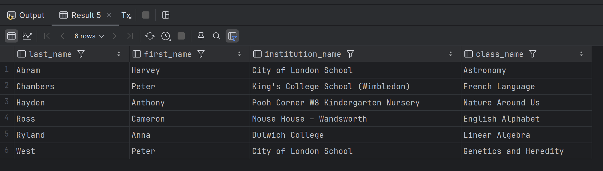
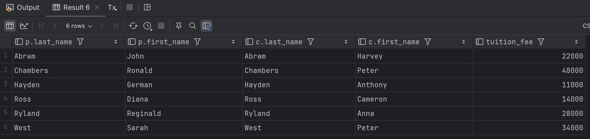
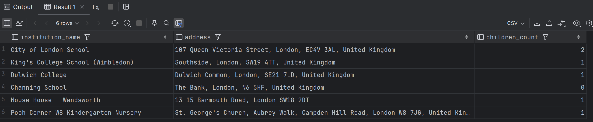

### Миграция и наполнение базы

Выполнить [`migration.sql`](migration.sql)

### Задания по SQL-запросам

#### Отримайте список всіх дітей разом із закладом, в якому вони навчаються, та напрямом навчання в класі

Выполнить [`all_children.sql`](all_children.sql)

Результат:

#### Отримайте інформацію про батьків і їхніх дітей разом із вартістю навчання

Выполнить [`parents_children.sql`](parents_children.sql)

Результат:

#### Отримайте список всіх закладів з адресами та кількістю дітей, які навчаються в кожному закладі

Выполнить [`institutions_children.sql`](institutions_children.sql)

Результат:

### Анонимизация

Выполнить [`anonymizer.sql`](anonymizer.sql)
