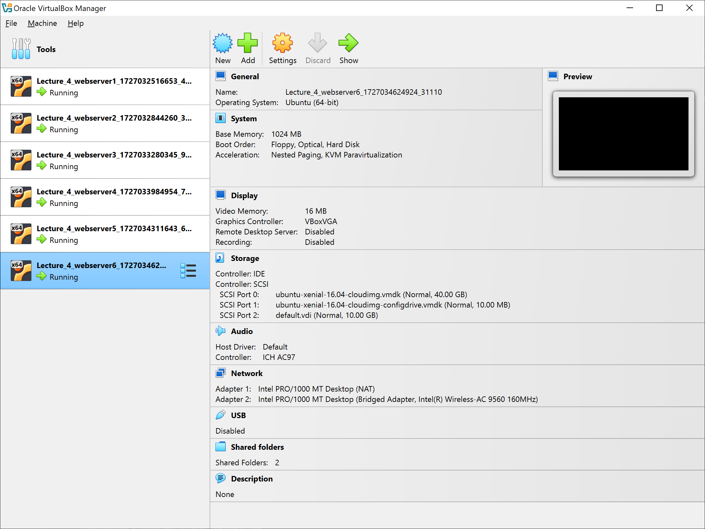

### Замечания к домашнему заданию

Конфигурация системы: Windows 10 Professional, Vagrant **2.4.1**, Oracle VirtualBox **7.1.0**

1. При первом запуске `vagrant up` Vagrant не смог обнаружить установленный VirtualBox и предложил явно указывать провайдера при запуске: `vagrant up --provider=virtualbox`. С этим ключом запустился нормально.

2. На следующем шаге Vagrant отказался работать с VirtualBox 7.1, выведя список совместимых провайдеров. Максимальной поддерживаемой версией VirtualBox оказалась версия 7.0. После изучения вопроса оказалось, что это проблема Vagrant, и в последнем обновлении она не решена: [тред на Github](https://github.com/hashicorp/vagrant/issues/13501). По указанной ссылке было описано, как вручную поправить гем конфигурации, чтобы устранить несовместимость. Заработало.

3. В документации Vagrant указано, что версия 2.4.1 поддерживает произвольный размер диска для хоста с помощью ключа `config.vm.disk`. В моем Vagrantfile я указал размер диска в 10 ГБ для каждой VM. Тем не менее, все созданные виртуальные машины установили размер диска по умолчанию в 40 ГБ, проигнорировав конфигурацию.

В остальном все прошло без сбоев, после запуска `vagrant up`, в системе появилось шесть виртуальных машин.

